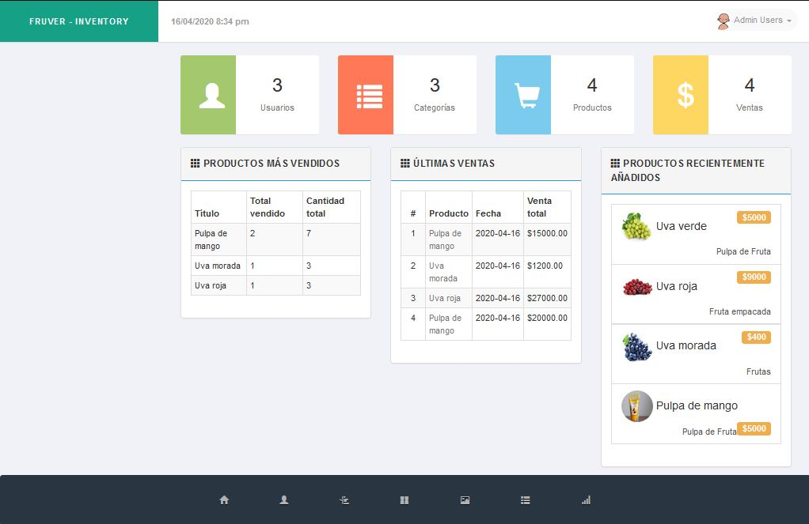

# Fruver_inventario

_Inventario web con php para negocios_

## Requisitos 📋

### Tener las siguientes secciones:

- Agregar usuarios con roles y permisos correspondientes (admin, special, user)

- seccion "home"
    - se verá productos vendidos, ultimas ventas, productos añadidos recientemente, 
    -cantidad en el sistema de: usuarios, categorias, productos y ventas
- seccion "usuarios"
    - se agregarán usuarios con permisos, nombre y cargo
- seccion productos
    -se podrán agregar productos con imagenes, precio compra, precio venta, categoria, cantidad ingresada
- seccion ventas
    - Se puede agregar ventas y ver las ventas realizadas 
    -hacer factura de las ventas realizadas en un día, un mes, o la fecha intruducida
    
#Beneficios 
  -Al poder tener todos los productos en la base de datos se elimina el error humano de organizacion de datos y es automatizado 
  para despues ser consultado para su posterior revición, llevando así una contabilidad impecable.

## Construido con 🛠️

_Menciona las herramientas que utilizaste para crear tu proyecto_

* [Bootstrap 4](https://getbootstrap.com/) - El framework web usado
* [Html][CSS][JavaScript] - Lenguaje front-end
* [PHP](https://www.php.net/) - Lenguaje Back-end

## Versionado 📌

Usamos [SemVer](http://semver.org/) para el versionado. Para todas las versiones disponibles, mira los [tags en este repositorio](https://github.com/tu/proyecto/tags).

## Autores ✒️

* **Luis Miguel Guevara** - *Trabajo Inicial* - [MegRov](https://github.com/MegRov)

